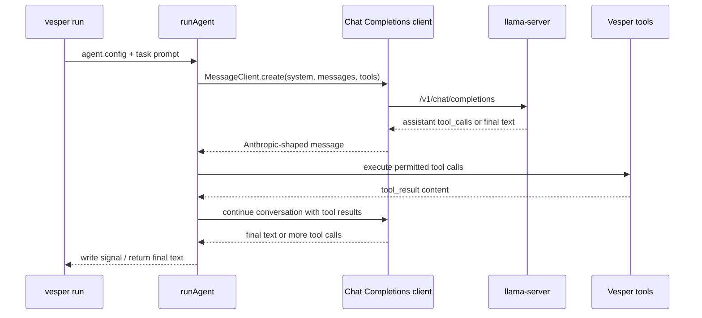

# feat: Add llama.cpp local model support

## Summary

Add an OpenAI-compatible Chat Completions path so Vesper can run its normal
single-prompt agent loop against a bare `llama-server` local model.

---

## Problem Frame

Vesper's runtime already normalizes hosted provider responses into an internal
Anthropic-shaped `MessageClient` interface. The current OpenAI adapter targets
the Responses API, but bare llama.cpp deployments expose the Chat Completions
surface for tool calling. The implementation needs to add that transport without
changing Vesper's single-invocation model or permission enforcement.

---

## Requirements

**Local llama.cpp invocation**

- R1. A `provider: openai` agent can opt into a Chat Completions API mode for
  a local `llama-server` endpoint.
- R2. The local Chat Completions mode runs through the same prompt, tool loop,
  signal, logging, token-budget, and context-management paths as hosted
  providers.
- R3. Local llama.cpp configuration does not require a real cloud API key.

**Tool-call compatibility**

- R4. Built-in and MCP tool definitions are converted to Chat Completions
  function tools without widening the configured permission surface.
- R5. Chat Completions assistant tool calls are converted into Vesper's
  internal tool-use blocks.
- R6. Vesper tool results are returned as Chat Completions tool messages so the
  same invocation can continue.
- R7. API failures or malformed local tool-call responses surface as normal
  Vesper failures instead of silently producing a false success.

**Compatibility and documentation**

- R8. Existing Anthropic and hosted OpenAI Responses configs continue to behave
  as they do today.
- R9. The configuration guide and example config document the llama.cpp setup
  path with `llama-server`, Chat Completions, a base URL, and tool-aware server
  configuration.
- R10. Tests cover request conversion, response conversion, config validation,
  and an end-to-end stubbed tool loop for the local Chat Completions mode.

---

## Key Technical Decisions

- **OpenAI API mode selector:** Add `openai_api: responses | chat_completions`
  rather than a `llama_cpp` provider. This preserves the existing provider
  identity while separating hosted Responses from local Chat Completions.
- **Base URL in agent config:** Put the endpoint URL in `base_url` so local
  model routing is explicit and portable across local and global agent configs.
- **No-key local default:** Let Chat Completions mode operate with a placeholder
  API key when no OpenAI key is set. Local servers commonly require an
  Authorization shape but do not validate a real secret.
- **Separate Chat Completions adapter:** Implement a distinct message client
  behind the existing `MessageClient` interface instead of overloading the
  Responses converter with incompatible request and response shapes.
- **Tolerant argument parsing:** Accept tool-call arguments as either JSON
  strings or already-parsed objects. Some local OpenAI-compatible servers have
  emitted the parsed-object form even when hosted OpenAI returns strings.
- **No CI dependency on llama.cpp:** Document a manual smoke test shape, but
  keep automated tests stubbed so `make check` does not require a local model.

---

## High-Level Technical Design

The adapter boundary stays at `MessageClient.create`. Everything after the
adapter receives the same internal message shape it already handles.

---

## Implementation Units

### U1. Add OpenAI endpoint configuration

- **Goal:** Extend agent YAML parsing so OpenAI agents can select Responses or
  Chat Completions and optionally set a local base URL.
- **Requirements:** R1, R3, R8, R9.
- **Dependencies:** None.
- **Files:** `src/config.ts`, `tests/config.test.ts`,
  `src/templates/example-agent.yml`, `docs/guide/configuration.md`,
  `docs/guide/cli.md`.
- **Approach:** Add `openai_api` and `base_url` config fields. Default
  `openai_api` to `responses` so existing `provider: openai` configs remain
  unchanged. Accept `base_url` only for OpenAI configs, and document the local
  no-real-key behavior without encouraging real secrets in YAML.
- **Patterns to follow:** Existing provider/model validation in `src/config.ts`;
  existing optional nested config parsing for `context_management`.
- **Test scenarios:**
  - Parse an existing `provider: openai` config with no new fields and verify
    the API mode defaults to Responses.
  - Parse a local Chat Completions config with a base URL and model.
  - Reject an invalid OpenAI API mode.
  - Reject `openai_api` or `base_url` when the provider is Anthropic.
  - Verify the example config and docs describe the new local mode.
- **Verification:** Config tests demonstrate backward-compatible defaults and
  valid local endpoint configuration.

### U2. Route message-client construction by OpenAI API mode

- **Goal:** Make runtime client selection depend on the full agent model API
  config, not only the provider enum.
- **Requirements:** R1, R2, R8.
- **Dependencies:** U1.
- **Files:** `src/agent.ts`, `tests/agent.test.ts`.
- **Approach:** Adjust the message-client factory path so `runAgent` can create
  the hosted Responses client or the local Chat Completions client from the
  resolved config. Preserve test injection through `MessageClient` stubs, and
  keep sub-agent dispatch using each child's resolved config.
- **Patterns to follow:** Existing `MessageClient` interface; existing
  `clientFactory` test seams; prior sub-agent provider-selection tests.
- **Test scenarios:**
  - Existing hosted OpenAI configs still instantiate the Responses client.
  - Local Chat Completions configs instantiate the new client with the configured
    base URL.
  - Sub-agents with a different OpenAI API mode use the child config's client.
  - Existing injected `MessageClient` tests still bypass default client
    creation.
- **Verification:** Runtime tests prove client selection changes only for the
  new local mode.

### U3. Implement Chat Completions request conversion

- **Goal:** Convert Vesper's internal system prompt, messages, and tools into
  OpenAI Chat Completions request payloads accepted by llama.cpp.
- **Requirements:** R2, R4, R6, R8.
- **Dependencies:** U2.
- **Files:** `src/agent.ts`, `tests/agent.test.ts`.
- **Approach:** Add a Chat Completions client class that uses the existing
  OpenAI SDK dependency with a configurable base URL and placeholder API key
  support. Convert system prompt blocks into a system message, user text into
  user messages, assistant tool-use blocks into assistant `tool_calls`, and
  tool results into `tool` messages. Convert Vesper tool schemas into
  Chat Completions function tools and pass the parallel-tool-call preference
  when available.
- **Patterns to follow:** Existing Responses conversion helpers in
  `src/agent.ts`; MCP schema validation already depends on provider-compatible
  object schemas.
- **Test scenarios:**
  - Convert a simple prompt with no tools into system and user chat messages.
  - Convert built-in tool definitions into Chat Completions function tools.
  - Convert a prior assistant tool use plus tool result back into assistant
    `tool_calls` and `tool` messages.
  - Preserve `parallel_tool_calls` when the runtime enables same-turn parallel
    tool calls.
  - Omit or normalize fields that llama.cpp is unlikely to accept if they are
    Responses-only.
- **Verification:** Captured SDK request payloads match the Chat Completions
  contract needed by `llama-server`.

### U4. Implement Chat Completions response conversion

- **Goal:** Convert Chat Completions responses from llama.cpp into Vesper's
  internal Anthropic-shaped messages.
- **Requirements:** R2, R5, R7, R10.
- **Dependencies:** U3.
- **Files:** `src/agent.ts`, `tests/agent.test.ts`.
- **Approach:** Parse assistant `message.content` into text blocks and
  `message.tool_calls` into tool-use blocks. Map finish reasons to Vesper stop
  reasons, including tool calls and length truncation. Normalize usage fields
  into the existing usage shape. Treat malformed responses as API failures that
  flow through Vesper's existing failure handling.
- **Patterns to follow:** Existing `convertOpenAIResponse`,
  `parseOpenAIArguments`, and `makeUsageFromOpenAI` behavior.
- **Test scenarios:**
  - Convert final assistant content into an `end_turn` message.
  - Convert one or more tool calls into `tool_use` blocks with stable IDs.
  - Parse tool arguments when they arrive as a JSON string.
  - Parse tool arguments when they arrive as an object.
  - Handle invalid tool arguments without bypassing permission checks.
  - Map truncation finish reasons to `max_tokens`.
  - Preserve token usage when the response includes usage data.
- **Verification:** Response conversion tests cover normal text, tool-call, and
  malformed-local-response paths.

### U5. Prove the local single-prompt tool loop

- **Goal:** Add an end-to-end stubbed test that proves local Chat Completions
  mode can complete Vesper's single-prompt loop with a tool call.
- **Requirements:** R2, R4, R5, R6, R7, R10.
- **Dependencies:** U1, U2, U3, U4.
- **Files:** `tests/agent.test.ts`.
- **Execution note:** Start with a failing integration-style unit test that
  drives `runAgent` through a read-only tool loop using the Chat Completions
  client seam.
- **Approach:** Stub the Chat Completions SDK surface or inject a client factory
  that first returns a tool call and then returns final text after receiving the
  tool result. Assert that the tool result reaches the second model call and
  that the final signal/output matches hosted-provider behavior.
- **Patterns to follow:** Existing `runAgent` tests with stub `MessageClient`;
  existing file-tool permission tests.
- **Test scenarios:**
  - Covers F1 / AE1. The local-mode run can complete a prompt with final text
    and no tool calls.
  - Covers AE2. The local-mode run receives a `read_file` tool call, executes it
    when permitted, sends the tool result back, and finishes with final text.
  - Covers AE3. A local-mode API failure during tool-call handling writes a
    failed signal with useful context.
  - A denied local-mode tool call returns a normal permission-denied tool result
    rather than bypassing Vesper's safety model.
- **Verification:** The test demonstrates the same observable lifecycle as a
  hosted-provider tool loop.

### U6. Document the llama.cpp operator path

- **Goal:** Document the supported local setup and make the example config
  discoverable.
- **Requirements:** R3, R8, R9.
- **Dependencies:** U1, U3, U4.
- **Files:** `README.md`, `docs/guide/configuration.md`, `docs/guide/cli.md`,
  `docs/guide/llama-cpp.md`, `src/templates/example-agent.yml`.
- **Approach:** Add a concise llama.cpp guide that shows the supported shape:
  start `llama-server` with tool-aware configuration, configure Vesper's
  OpenAI Chat Completions mode with a local base URL, run a normal single prompt,
  and use the documented manual smoke test. Name model quality and template
  issues as operator concerns, not Vesper runtime failures.
- **Patterns to follow:** Existing `docs/guide/` topic docs and README concept
  summaries.
- **Test scenarios:** Test expectation: none -- documentation changes are
  verified by review and by `make check` linting/typechecking the codebase.
- **Verification:** Docs give an operator enough information to run the manual
  local smoke test without installing LM Studio.

---

## Scope Boundaries

- No `provider: llama_cpp` alias in the first pass.
- No LM Studio-specific setup, detection, screenshots, or troubleshooting.
- No `/v1/responses` requirement for local models.
- No automatic `llama-server` launch or model download.
- No streaming support.
- No guarantee that every local model will choose tools well.

### Deferred to Follow-Up Work

- Model-specific context-window configuration beyond the current unknown-model
  fallback.
- Live integration tests that launch llama.cpp in CI.
- Broader OpenAI-compatible local-server compatibility beyond bare
  `llama-server`.

---

## Risks & Dependencies

- **Tool-call reliability depends on model and template setup.** The Vesper
  adapter can prove protocol compatibility, but it cannot make a weak local
  model choose tools correctly.
- **llama.cpp compatibility can drift.** Keep the adapter tolerant around
  tool-call argument shape, and keep docs explicit about the supported
  `llama-server` setup.
- **Factory changes can affect sub-agents.** Client creation must use each
  agent's resolved config so parent and child agents can use different model
  API modes.
- **Config naming becomes public API.** The new API-mode and base-URL fields
  should be documented carefully before implementation lands.

---

## Documentation / Operational Notes

- The llama.cpp guide should include a manual smoke-test checklist, not a CI
  requirement.
- Documentation should state that `--jinja` or an equivalent tool-aware template
  setup is required for tool calling.
- Documentation should recommend setting `model` to the `llama-server` alias
  when the operator has configured one, while keeping the local no-real-key case
  easy.

---

## Sources / Research

- Origin requirements: `docs/brainstorms/2026-06-19-llama-cpp-local-models-requirements.md`.
- Current config provider validation: `src/config.ts`.
- Current hosted OpenAI Responses adapter and `MessageClient` boundary:
  `src/agent.ts`.
- Current adapter tests: `tests/agent.test.ts`.
- Current config tests: `tests/config.test.ts`.
- Structural safety learning:
  `docs/solutions/best-practices/structural-permission-enforcement-agent-runtime-2026-04-12.md`.
- Single-invocation runtime learning:
  `docs/solutions/best-practices/single-invocation-agent-runtime-separation-of-concerns-2026-04-13.md`.
- llama.cpp function-calling documentation describes OpenAI-style function
  calling for `llama-server` when started with `--jinja`.
